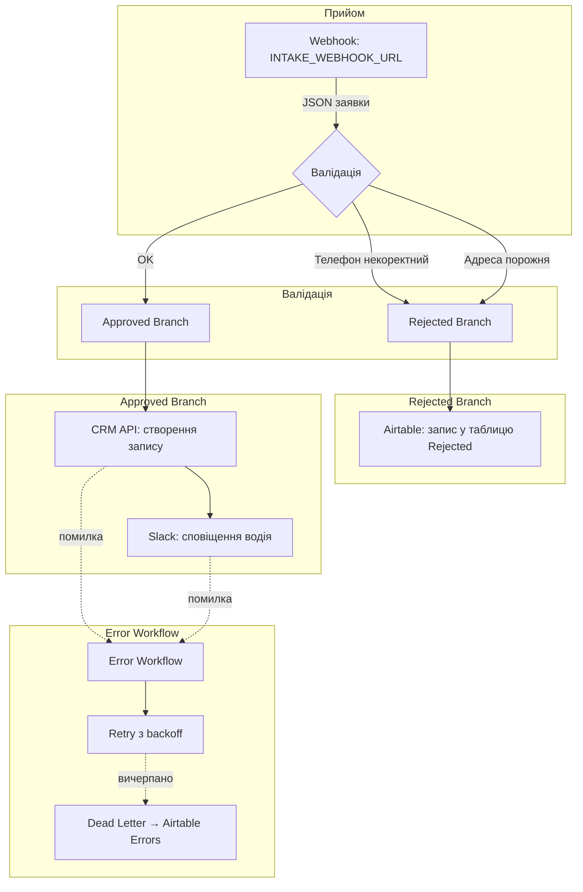

# Вихід прогону 06b — `n8n-integration-spec` v2

> Відповідь агента без правок (headless `claude -p`, Opus 4.5, 2026-09-14).
> Вхід — лише `docs/sanitized-brief.md`. Аналіз — [06-n8n-integration-spec.md](./06-n8n-integration-spec.md).

---

# Технічна специфікація n8n-воркфлоу: Автоматизація заявок [CLIENT_1]

## 1. Потік

---

## 2. Вузли

| # | Вузол n8n | Що робить | Вхід → Вихід | Credential / Змінна |
|---|-----------|-----------|--------------|---------------------|
| 1 | **Webhook** | Приймає POST із заявкою | HTTP POST → JSON `{customer, phone, address, amount}` | `INTAKE_WEBHOOK_URL` |
| 2 | **IF (валідація телефону)** | Перевіряє формат телефону regex | JSON → boolean pass/fail | — |
| 3 | **IF (валідація адреси)** | Перевіряє непорожність поля `address` | JSON → boolean pass/fail | — |
| 4 | **Airtable (Rejected)** | Записує відхилену заявку | JSON → row ID | `AIRTABLE_BASE_ID`, `AIRTABLE_PAT` |
| 5 | **HTTP Request (CRM)** | Створює запис заявки в CRM | JSON → CRM response | `CRM_API_KEY` |
| 6 | **Slack** | Надсилає повідомлення водію | JSON → message ts | `SLACK_BOT_TOKEN` |
| 7 | **Error Workflow** | Обробляє збої CRM/Slack | error object → retry/dead-letter | `AIRTABLE_BASE_ID`, `AIRTABLE_PAT` |

---

## 3. Валідація

### 3.1 Правила

| Поле | Правило | Regex / Логіка |
|------|---------|----------------|
| **Телефон** | Формат: `+380 (XX) XXX-XX-XX` — рівно 10 цифр після `+380`, код оператора у дужках, групи через дефіс | `^\+380 \(\d{2}\) \d{3}-\d{2}-\d{2}$` |
| **Адреса** | Непорожня (не `null`, не пустий рядок, не лише пробіли) | `address?.trim().length > 0` |

### 3.2 Перевірка синтетичних рядків

| # | Телефон | Формат OK? | Адреса | Адреса OK? | **Результат** |
|---|---------|------------|--------|------------|---------------|
| 1 | `+380 (00) 000-00-01` | ✅ відповідає regex | `м. Тестове, вул. Прикладна 1, кв. 1` | ✅ непорожня | **ACCEPTED** |
| 2 | `+380 (00) 000-0` | ❌ лише 7 цифр після коду | `м. Тестове, просп. Зразковий 2` | ✅ непорожня | **REJECTED** (телефон) |
| 3 | `+380 (00) 000-00-03` | ✅ відповідає regex | `_(порожньо)_` → `""` | ❌ порожня | **REJECTED** (адреса) |

---

## 4. Критерії приймання → Реалізація → Тест-кейс

| Критерій з брифу | Як забезпечено | Тест-кейс |
|------------------|----------------|-----------|
| **Заявка з некоректним телефоном не потрапляє в CRM** | Вузол 2 (IF телефон): regex `^\+380 \(\d{2}\) \d{3}-\d{2}-\d{2}$`; fail → гілка Rejected, вузол 5 (CRM) недосяжний | POST синтетичний рядок 2 → перевірити: CRM не викликано (mock / logs), запис з'явився в Airtable Rejected |
| **Заявка без адреси доставки не потрапляє в CRM** | Вузол 3 (IF адреса): `address?.trim().length > 0`; fail → гілка Rejected | POST синтетичний рядок 3 → перевірити: CRM не викликано, запис у Airtable Rejected з причиною "empty_address" |
| **Сповіщення водію ≤ 2 хв після заявки** | Тригер: Webhook (синхронний, instant); потік: Webhook → валідація → CRM → Slack — лінійний, без пауз; точка виміру: `{{$now}}` у Webhook vs `message.ts` у Slack response | End-to-end тест: POST валідну заявку, порівняти timestamp Webhook і Slack message; diff ≤ 120 000 ms |
| **Усі відхилені заявки видно в окремому звіті** | Вузол 4: Airtable таблиця `Rejected` з полями — див. 4.1; звіт: Airtable View або експорт | Перевірити: після POST рядків 2 і 3 обидва записи присутні в таблиці `Rejected` з коректними полями |

### 4.1 Структура запису Rejected (Airtable)

| Поле | Тип | Опис |
|------|-----|------|
| `received_at` | DateTime | Timestamp надходження |
| `customer` | String | Ім'я замовника |
| `phone` | String | Переданий телефон |
| `address` | String | Передана адреса (може бути порожня) |
| `amount` | Number | Сума |
| `rejection_reason` | Single Select | `invalid_phone` \| `empty_address` |
| `raw_payload` | Long Text | JSON оригіналу для дебагу |

---

## 5. Збої й повтори

### 5.1 Недоступність CRM

| Аспект | Поведінка |
|--------|-----------|
| Retry | n8n native retry: 3 спроби, exponential backoff (1 → 2 → 4 с) |
| Після вичерпання | Error Workflow записує заявку в Airtable таблицю `Errors` з `error_source = CRM`, `error_message`, `raw_payload` |
| Гарантія | Заявка не губиться: або потрапляє в CRM, або в `Errors` для ручної обробки |

### 5.2 Недоступність Slack

| Аспект | Поведінка |
|--------|-----------|
| Retry | 3 спроби, exponential backoff |
| Після вичерпання | Error Workflow записує в `Errors` з `error_source = Slack`; запис у CRM **вже створено** — не відкочується |
| Гарантія | Заявка в CRM; водій не отримав повідомлення — видно в `Errors`, менеджер сповіщає вручну |

### 5.3 Недоступність Airtable (Rejected / Errors)

| Аспект | Поведінка |
|--------|-----------|
| Retry | 3 спроби |
| Після вичерпання | **ПРИПУЩЕННЯ:** n8n надсилає алерт на email / Slack операційника (потрібен окремий канал або email) — потребує уточнення |

---

## 6. Навантаження

| Параметр | Значення |
|----------|----------|
| Середній потік | ~400 заявок/тиждень ≈ 57/день ≈ 7/год (8-год робочий день) |
| Пікові дні | Пн, Чт — **ПРИПУЩЕННЯ:** коефіцієнт ×2 → ~14/год |
| Піковий burst | **ПРИПУЩЕННЯ:** пік у межах години — ×3 до середнього пікового → ~42/год ≈ 0.7/хв |
| Черга | **Не потрібна** — n8n обробляє паралельно; 1 заявка/хв із лінійним потоком (4 HTTP-виклики) не створює backpressure |
| Рекомендація | Моніторити execution time; якщо CRM throttle — додати queue mode у Webhook node |

---

## 7. Відкриті питання до клієнта

| # | Питання | Чому важливо |
|---|---------|--------------|
| 1 | **Канал Slack для сповіщень**: який channel ID або username водія? | Вузол Slack потребує destination |
| 2 | **Формат повідомлення водію**: що саме відображати (замовник, адреса, сума, посилання на CRM-запис)? | Визначає payload Slack |
| 3 | **Endpoint CRM**: який HTTP method і path для створення заявки? Які поля обов'язкові? | Визначає конфігурацію HTTP Request |
| 4 | **Airtable base**: чи вже є таблиці `Rejected`, `Errors`, чи створити? | Визначає setup |
| 5 | **Роль Postgres**: у переліку доступів є `ORDERS_DB_URL` (репліка), але в задачі не вказано, для чого він потрібен у цьому воркфлоу | Якщо не потрібен — не використовуємо; якщо потрібен (напр., перевірка дублікатів) — уточнити логіку |
| 6 | **Алерт при збої Airtable**: куди надсилати (email, окремий Slack-канал)? | Error Workflow для останньої лінії захисту |
| 7 | **Часовий пояс**: у якому TZ фіксувати `received_at`? | Консистентність timestamps |
| 8 | **Автентифікація Webhook**: чи потрібен shared secret / HMAC для захисту вхідного endpoint? | Безпека продакшену |

---

## Мапа поточного ручного процесу → автоматизація

| Крок ручного процесу (з брифу) | Замінено вузлом | Примітка |
|-------------------------------|-----------------|----------|
| Менеджер копіює дані з пошти в Google Sheets | **Виключено** — джерело змінено на Webhook | Google Sheets не фігурує в доступах; вхід — POST на Webhook |
| Менеджер створює запис у CRM | Вузол 5 (HTTP Request → CRM) | Автоматично |
| Менеджер повідомляє водія в Slack | Вузол 6 (Slack) | Автоматично |

---

## Stop

Специфікацію завершено. Відкриті питання (розділ 7) потребують відповіді клієнта перед генерацією JSON воркфлоу.
