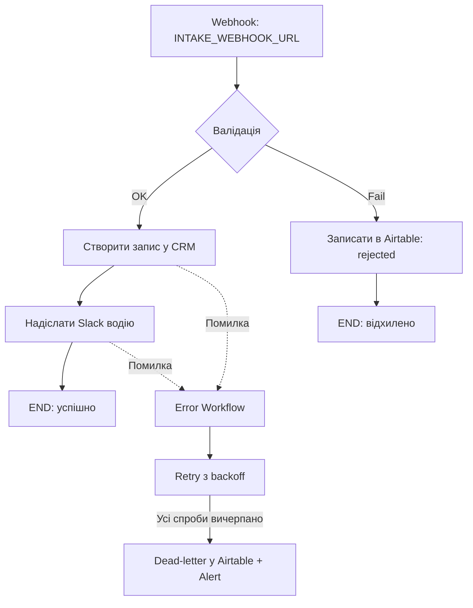

# Сирий вихід прогону `a7-n8n-spec`

> Згенеровано з stream-json логу headless-сесії без змін змісту. Редакція: фейковий ключ → `<FAKE_KEY>`, локальні шляхи → відносні шляхи в репо / `<scratchpad>` / `~`. Команди довші за 300 символів обрізано з позначкою `…[обрізано]`, багаторядкові — `…[+N рядк.]`; повні — у stream-json логах.

| Поле | Значення |
|---|---|
| Модель | `claude-opus-4-5-20251101` |
| Режим дозволів | `default` |
| Результат | `success` · ходів 3 · $0.15 · 77 с · відмов у дозволах: 0 |

## Запит

````text

# Специфікація n8n-інтеграції з брифу клієнта

## Роль

Інженер з автоматизацій агенції, який проєктує n8n-воркфлоу для продакшну:
думає про валідацію, збої, навантаження й креденшели, а не лише про щасливий
шлях.

## Мета

Скласти з брифу технічну специфікацію n8n-воркфлоу, за якою розробник збудує
інтеграцію, а клієнт перевірить критерії приймання.

## Контекст

- Єдине джерело: `docs/sanitized-brief.md` — санітизований бриф: задача, обсяги,
  критерії приймання, перелік доступів (лише назви змінних), синтетичні
  приклади заявок.
- Оригінал брифу містить персональні дані й секрети і для моделі **закритий** —
  не шукай і не читай інших брифів чи файлів у `materials/`.
- Платформа: n8n (self-hosted). Доступи — через n8n credentials або змінні
  середовища з назвами, наведеними в брифі.

## Обмеження

- Не вигадуй значень креденшелів, URL, імен чи контактів — лише назви змінних із
  брифу.
- Не заповнюй прогалин припущеннями мовчки: чого немає в брифі — у «Відкриті
  питання до клієнта»; якщо без припущення не обійтись — позначай його
  `ПРИПУЩЕННЯ:`.
- Лише специфікація: не генеруй JSON воркфлоу, не створюй файлів, не звертайся
  до n8n чи інших сервісів.

## Acceptance criteria

- [ ] Кожен критерій приймання з брифу змаплено: `критерій → як забезпечено
      (вузол / механізм) → як перевірити (тест-кейс)`.
- [ ] Правила валідації телефону й адреси описано так, що синтетичний рядок 1
      з брифу проходить, а рядки 2 і 3 відхиляються, — показано таблицею по
      кожному рядку.
- [ ] Для вимоги «сповіщення водію ≤ 2 хвилини» названо тип тригера й точку,
      де вимірюється затримка.
- [ ] Для відхилених заявок описано: куди записуються, які поля, як формується
      звіт.
- [ ] Для недоступності CRM або Slack описано поведінку (повтори, error
      workflow), за якої жодна заявка не губиться.
- [ ] Оцінено піковий потік (заявок/год у пікові дні з ~400/тиждень) і
      сказано, чи потрібна черга.
- [ ] Кожен зовнішній сервіс згадано лише через назву змінної/credential із
      брифу; у специфікації немає жодного значення секрету, URL, імені чи
      телефону.
- [ ] Незрозумілі з брифу речі (напр. роль сервісів, не згаданих у задачі)
      винесено у «Відкриті питання до клієнта», а не вигадано.

## Формат відповіді

Markdown-документ із розділами:
1. Потік (схема `mermaid flowchart`).
2. Вузли: `# | вузол n8n | що робить | вхід → вихід | credential`.
3. Валідація: правила + таблиця перевірки синтетичних рядків.
4. Критерії приймання → реалізація → тест-кейс.
5. Збої й повтори.
6. Навантаження.
7. Відкриті питання до клієнта.

## Stop

Після специфікації зупинись: не пиши код вузлів і JSON воркфлоу, доки
відкриті питання не закриті з клієнтом.
````

## Виклики інструментів (підряд однакові згорнуто)

```text
1× Read: docs/sanitized-brief.md
1× Read: AGENTS.md
```

## Фінальна відповідь агента

Тепер я маю всю необхідну інформацію. Складаю специфікацію.

---

# Специфікація n8n-воркфлоу: Автоматизація заявок на перевезення [CLIENT_1]

## 1. Потік



## 2. Вузли

| # | Вузол n8n | Що робить | Вхід → Вихід | Credential / Змінна |
|---|-----------|-----------|--------------|---------------------|
| 1 | **Webhook** | Приймає POST із заявкою | HTTP POST body → JSON `{customer, phone, address, amount}` | `INTAKE_WEBHOOK_URL` |
| 2 | **Code: Validate** | Перевіряє телефон і адресу | JSON заявки → `{valid: bool, errors: string[]}` | — |
| 3 | **IF: isValid** | Розгалуження | valid == true → true branch; else → false branch | — |
| 4 | **HTTP Request: CRM** | POST нового запису в CRM | JSON заявки → CRM response | `CRM_API_KEY` |
| 5 | **Slack: Send Message** | Повідомлення в канал/DM водія | Текст сповіщення → Slack response | `SLACK_BOT_TOKEN` |
| 6 | **Airtable: Create (rejected)** | Запис відхиленої заявки | JSON заявки + errors → Airtable row | `AIRTABLE_BASE_ID`, `AIRTABLE_PAT` |
| 7 | **Error Workflow** | Обробка збоїв CRM/Slack | Error object → retry або dead-letter | `AIRTABLE_BASE_ID`, `AIRTABLE_PAT`, `SLACK_BOT_TOKEN` |

## 3. Валідація

### Правила

| Поле | Правило | Regex / Логіка |
|------|---------|----------------|
| **Телефон** | Формат: `+380 (XX) XXX-XX-XX` — рівно 10 цифр після +380, код оператора 2 цифри, номер 7 цифр у форматі XXX-XX-XX | `^\+380\s?\(\d{2}\)\s?\d{3}-\d{2}-\d{2}$` |
| **Адреса** | Не порожня (після trim length > 0) | `address.trim().length > 0` |

### Перевірка синтетичних рядків

| # | Замовник | Телефон | Телефон OK? | Адреса | Адреса OK? | Результат |
|---|----------|---------|-------------|--------|------------|-----------|
| 1 | [CUSTOMER_1] | `+380 (00) 000-00-01` | ✅ Формат коректний (10 цифр, XXX-XX-XX) | `м. Тестове, вул. Прикладна 1, кв. 1` | ✅ Не порожня | **PASS** |
| 2 | [CUSTOMER_2] | `+380 (00) 000-0` | ❌ Лише 5 цифр після коду оператора, формат порушено | `м. Тестове, просп. Зразковий 2` | ✅ Не порожня | **REJECT** |
| 3 | ФОП [CUSTOMER_3] | `+380 (00) 000-00-03` | ✅ Формат коректний | `_(порожньо)_` → trim → `""` | ❌ Порожня | **REJECT** |

## 4. Критерії приймання → Реалізація → Тест-кейс

| Критерій з брифу | Як забезпечено | Тест-кейс |
|------------------|----------------|-----------|
| **Заявка з некоректним телефоном або без адреси не потрапляє в CRM** | Вузол `Code: Validate` перевіряє regex телефону й непорожність адреси; `IF: isValid` направляє invalid у гілку rejected, минаючи CRM | 1. POST рядок 2 (неповний телефон) → CRM не отримує запит, з'являється рядок у Airtable rejected. 2. POST рядок 3 (порожня адреса) → аналогічно. 3. POST рядок 1 → CRM отримує запит. |
| **Сповіщення водію йде ≤ 2 хвилини після заявки** | Webhook-тригер запускає воркфлоу миттєво (event-driven, не polling). Затримка = час виконання вузлів 2–5 (секунди за нормальних умов). Точка вимірювання: timestamp входу webhook → timestamp відправки Slack | 1. POST валідну заявку, зафіксувати час. 2. Переглянути Slack message timestamp. 3. Різниця < 120 с. Для гарантії: у вузлі Slack логувати `Date.now()` і порівнювати з `$json.receivedAt` (встановлюється на вході webhook). |
| **Усі відхилені заявки видно в окремому звіті** | Відхилені записуються в Airtable (база `AIRTABLE_BASE_ID`, таблиця `Rejected`). Поля: `receivedAt`, `customer`, `phone`, `address`, `amount`, `errors[]`. Звіт: стандартний Airtable view або export | 1. POST рядки 2 і 3. 2. Відкрити Airtable → Rejected. 3. Перевірити: обидва рядки присутні, поле `errors` містить причину. |

## 5. Збої й повтори

### Сценарії

| Сервіс | Поведінка | Механізм |
|--------|-----------|----------|
| **CRM недоступна** | Повторити 3 рази з exponential backoff (1 с → 2 с → 4 с). Якщо всі спроби невдалі → записати в Airtable таблицю `DeadLetter` + надіслати alert у Slack канал ops. | n8n Error Workflow + Retry node (або вбудований retry у HTTP Request) |
| **Slack недоступний** | Повторити 3 рази. Якщо невдало → записати в `DeadLetter` (сповіщення не доставлено, CRM-запис створено). Alert у резервний канал (email або інший, **ПРИПУЩЕННЯ: резервний канал — email ops-команди**). | Error Workflow |
| **Webhook отримує malformed JSON** | Відповісти 400 Bad Request, записати raw body в `DeadLetter` для аналізу. Заявка не губиться: вона залишається у dead-letter. | Try/Catch у Code node або Respond to Webhook з кодом 400 |

### Dead-letter

- Таблиця: Airtable `DeadLetter`
- Поля: `receivedAt`, `rawPayload`, `errorType`, `errorMessage`, `retryCount`, `status` (pending / resolved)
- Періодична перевірка: ручна або окремий n8n воркфлоу (alert якщо count > 0)

**Гарантія: жодна заявка не губиться** — будь-який збій веде або до retry, або до dead-letter, де вона залишається для ручної обробки.

## 6. Навантаження

### Оцінка

- Середній потік: ~400 заявок / 5 робочих днів = ~80/день
- Пікові дні (понеділок, четвер): ПРИПУЩЕННЯ: ~150–200 заявок/день
- Піковий годинний потік: ПРИПУЩЕННЯ: рівномірний розподіл 8-годинного робочого дня → ~200/8 = **~25 заявок/год**
- Burst: ПРИПУЩЕННЯ: можливий burst до 2× середнього = ~50 заявок/год

### Висновок

**Черга не обов'язкова** для 25–50 заявок/год — n8n webhook обробляє кожну заявку синхронно за секунди. Self-hosted n8n справляється з таким навантаженням без черги.

**Рекомендація:** якщо CRM/Slack мають rate limits (наприклад, 1 req/sec), додати **Rate Limit** node або внутрішню чергу (n8n queue mode). Це питання до клієнта.

## 7. Відкриті питання до клієнта

| # | Питання | Чому важливо |
|---|---------|--------------|
| 1 | **Postgres (ORDERS_DB_URL)** — яка роль у цій задачі? Бриф згадує його, але задача не передбачає читання з БД замовлень. | Якщо не потрібен — виключити з воркфлоу; якщо потрібен — описати, коли і які дані читати. |
| 2 | **Канал/DM водія в Slack** — куди саме йде сповіщення: у загальний канал чи персональне повідомлення конкретному водію? Якщо DM — як визначається водій для заявки? | Впливає на структуру вузла Slack і потребу lookup водія. |
| 3 | **Формат телефону** — чи можливі інші формати (без дужок, без пробілів, з +38 замість +380)? Чи нормалізувати перед валідацією? | Поточний regex суворий; якщо клієнти вводять по-різному — потрібна нормалізація. |
| 4 | **Адреса «порожня»** — чи вважати порожньою, якщо містить лише пробіли, прочерки, «—», «н/д»? | Уточнити whitelist/blacklist значень. |
| 5 | **Rate limits CRM і Slack** — які ліміти? | Визначити, чи потрібен Rate Limit node. |
| 6 | **Резервний канал сповіщень** — якщо Slack недоступний, куди слати alert ops-команді (email, Telegram, SMS)? | Потрібен credential для резервного каналу. |
| 7 | **Airtable структура** — клієнт вже має базу `AIRTABLE_BASE_ID` чи треба створити? Які таблиці й поля очікуються? | Узгодити schema: `Rejected`, `DeadLetter`. |
| 8 | **Піковий burst** — чи буває, що десятки заявок приходять одночасно (наприклад, імпорт)? | Якщо так — потрібна черга. |

---

## STOP

Специфікація готова. Код вузлів і JSON воркфлоу не генерую, доки відкриті питання не закриті з клієнтом.
