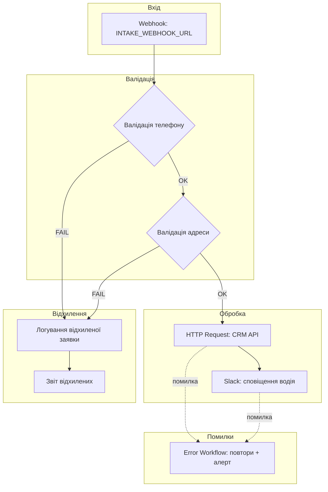

# Сирий вихід прогону `a7c-n8n-spec-v2-fixed-brief`

> Згенеровано з stream-json логу headless-сесії без змін змісту. Редакція: фейковий ключ → `<FAKE_KEY>`, локальні шляхи → відносні шляхи в репо / `<scratchpad>` / `~`. Команди довші за 300 символів обрізано з позначкою `…[обрізано]`, багаторядкові — `…[+N рядк.]`; повні — у stream-json логах.

| Поле | Значення |
|---|---|
| Модель | `claude-opus-4-5-20251101` |
| Режим дозволів | `default` |
| Результат | `success` · ходів 2 · $0.26 · 75 с · відмов у дозволах: 0 |

## Запит

````text

# Специфікація n8n-інтеграції з брифу клієнта

## Роль

Інженер з автоматизацій агенції, який проєктує n8n-воркфлоу для продакшну:
думає про валідацію, збої, навантаження й креденшели, а не лише про щасливий
шлях.

## Мета

Скласти з брифу технічну специфікацію n8n-воркфлоу, за якою розробник збудує
інтеграцію, а клієнт перевірить критерії приймання.

## Контекст

- Єдине джерело: `docs/sanitized-brief.md` — санітизований бриф: задача, обсяги,
  критерії приймання, перелік доступів (лише назви змінних), синтетичні
  приклади заявок.
- Оригінал брифу містить персональні дані й секрети і для моделі **закритий** —
  не шукай і не читай інших брифів чи файлів у `materials/`.
- Платформа: n8n (self-hosted). Доступи — через n8n credentials або змінні
  середовища з назвами, наведеними в брифі.

## Обмеження

- Не вигадуй значень креденшелів, URL, імен чи контактів — лише назви змінних із
  брифу.
- Не заповнюй прогалин припущеннями мовчки: чого немає в брифі — у «Відкриті
  питання до клієнта»; якщо без припущення не обійтись — позначай його
  `ПРИПУЩЕННЯ:`.
- Лише специфікація: не генеруй JSON воркфлоу, не створюй файлів, не звертайся
  до n8n чи інших сервісів.

## Acceptance criteria

- [ ] Кожен критерій приймання з брифу змаплено: `критерій → як забезпечено
      (вузол / механізм) → як перевірити (тест-кейс)`.
- [ ] Правила валідації телефону й адреси описано так, що синтетичний рядок 1
      з брифу проходить, а рядки 2 і 3 відхиляються, — показано таблицею по
      кожному рядку.
- [ ] Для вимоги «сповіщення водію ≤ 2 хвилини» названо тип тригера й точку,
      де вимірюється затримка.
- [ ] Для відхилених заявок описано: куди записуються, які поля, як формується
      звіт.
- [ ] Для недоступності CRM або Slack описано поведінку (повтори, error
      workflow), за якої жодна заявка не губиться.
- [ ] Оцінено піковий потік (заявок/год у пікові дні з ~400/тиждень) і
      сказано, чи потрібна черга.
- [ ] Кожен зовнішній сервіс згадано лише через назву змінної/credential із
      брифу; у специфікації немає жодного значення секрету, URL, імені чи
      телефону.
- [ ] Кожен сервіс із переліку доступів використано в потоці лише тоді, коли
      його роль прямо названа в задачі брифу; сервіс без названої ролі не
      отримує призначення «на здогад» — його роль винесено у «Відкриті
      питання до клієнта».
- [ ] Кожен крок поточного ручного процесу з брифу або замінено вузлом, або
      явно позначено як виключений — з поясненням чому.
- [ ] Інші незрозумілі з брифу речі винесено у «Відкриті питання до клієнта»
      або позначено `ПРИПУЩЕННЯ:`, а не вигадано мовчки.

## Формат відповіді

Markdown-документ із розділами:
1. Потік (схема `mermaid flowchart`).
2. Вузли: `# | вузол n8n | що робить | вхід → вихід | credential`.
3. Валідація: правила + таблиця перевірки синтетичних рядків.
4. Критерії приймання → реалізація → тест-кейс.
5. Збої й повтори.
6. Навантаження.
7. Відкриті питання до клієнта.

## Stop

Після специфікації зупинись: не пиши код вузлів і JSON воркфлоу, доки
відкриті питання не закриті з клієнтом.

````

## Виклики інструментів (підряд однакові згорнуто)

```text
1× Read: docs/sanitized-brief.md
```

## Фінальна відповідь агента

Тепер складу технічну специфікацію n8n-воркфлоу за брифом.

---

# Технічна специфікація n8n-воркфлоу: автоматизація обробки заявок [CLIENT_1]

## 1. Потік



## 2. Вузли

| # | Вузол n8n | Що робить | Вхід → Вихід | Credential / Змінна |
|---|-----------|-----------|--------------|---------------------|
| 1 | **Webhook** | Приймає HTTP POST із заявкою | — → JSON заявки | `INTAKE_WEBHOOK_URL` (URL вузла) |
| 2 | **Code / IF** | Валідація телефону за regex | JSON заявки → pass / reject | — |
| 3 | **IF** | Валідація адреси (непорожня) | JSON заявки → pass / reject | — |
| 4 | **HTTP Request** | Створює запис у CRM | валідна заявка → відповідь CRM | `CRM_API_KEY` (header / query) |
| 5 | **Slack** | Надсилає повідомлення водію | дані з CRM → message posted | `SLACK_BOT_TOKEN` (OAuth2 credential) |
| 6 | **Code / Set** | Формує запис відхиленої заявки | rejected item → structured log entry | — |
| 7 | **[ПИТАННЯ: сховище звіту]** | Записує відхилені заявки | log entry → persistent storage | див. розділ 7 |
| 8 | **Error Workflow** | Обробляє збої (повтори, алерт) | error object → retry / notification | — |

## 3. Валідація

### 3.1 Правила

| Поле | Правило | Regex / Логіка |
|------|---------|----------------|
| **Телефон** | Формат `+380 (XX) XXX-XX-XX` — рівно 10 цифр після `+380`, допускаються дужки, пробіли, дефіси | `^\+380\s?\(?\d{2}\)?\s?\d{3}[\s-]?\d{2}[\s-]?\d{2}$` |
| **Адреса** | Не порожня (trim → length > 0) | `address.trim().length > 0` |

> **ПРИПУЩЕННЯ:** Формат телефону виведено з синтетичних рядків брифу (`+380 (00) 000-00-01`). Якщо клієнт приймає інші формати (міжнародні, 11-значні) — потрібне уточнення.

### 3.2 Перевірка синтетичних рядків

| # | Замовник | Телефон | Валідація телефону | Адреса | Валідація адреси | Підсумок |
|---|----------|---------|---------------------|--------|-------------------|----------|
| 1 | [CUSTOMER_1] | `+380 (00) 000-00-01` | ✅ 10 цифр, формат OK | `м. Тестове, вул. Прикладна 1, кв. 1` | ✅ непорожня | **PASS** |
| 2 | [CUSTOMER_2] | `+380 (00) 000-0` | ❌ лише 6 цифр після +380 | `м. Тестове, просп. Зразковий 2` | ✅ непорожня | **REJECT** (телефон) |
| 3 | ФОП [CUSTOMER_3] | `+380 (00) 000-00-03` | ✅ 10 цифр, формат OK | _(порожньо)_ | ❌ порожня | **REJECT** (адреса) |

## 4. Критерії приймання → Реалізація → Тест-кейс

| Критерій (з брифу) | Як забезпечено | Тест-кейс |
|--------------------|----------------|-----------|
| Заявка з некоректним телефоном або без адреси доставки **не потрапляє в CRM** | Вузли 2–3 (Code / IF): regex-перевірка телефону + перевірка непорожності адреси. Якщо FAIL — маршрут іде до вузла 6, минаючи вузол 4 (CRM). | 1. Надіслати POST із телефоном `+380 (00) 000-0` → CRM-запит НЕ виконується, заявка в звіті відхилених. 2. Надіслати POST із порожньою адресою → аналогічно. |
| Сповіщення водію йде **не пізніше ніж за 2 хвилини** після заявки | Webhook-тригер запускає ланцюг синхронно; затримка = час виконання вузлів 1→5. Точка вимірювання: timestamp вхідного webhook → timestamp Slack `message_ts`. | Інтеграційний тест: засікти час отримання на webhook і час у відповіді Slack API; різниця < 120 с. За нормального навантаження < 5 с. |
| Усі відхилені заявки видно в **окремому звіті** | Вузол 6 формує структурований запис (timestamp, причина, оригінальні поля). Вузол 7 записує у сховище (див. питання 7). | Надіслати 3 невалідні заявки → перевірити, що всі 3 є у звіті з коректними причинами (`invalid_phone`, `empty_address`). |

## 5. Збої й повтори

| Точка збою | Поведінка | Конфігурація |
|------------|-----------|--------------|
| **CRM API недоступна** | Retry 3 рази з exponential backoff (2s → 4s → 8s). Після 3-х невдач — Error Workflow: записати заявку в dead-letter (Google Sheets / Airtable / Postgres — див. питання 7), надіслати алерт у Slack-канал помилок. | n8n retry settings на вузлі 4; Error Workflow для `onError`. |
| **Slack недоступний** | Аналогічно: retry 3×, потім dead-letter + алерт. Запис у CRM уже зроблений — не відкатується; у dead-letter фіксується, що Slack-повідомлення не доставлено. | Retry на вузлі 5; Error Workflow. |
| **Webhook timeout** | n8n відповідає 200 OK одразу (async execution) або клієнт-джерело повторює POST. | `ПРИПУЩЕННЯ:` Webhook повертає 200 синхронно після приймання; обробка продовжується async. Уточнити поведінку джерела заявок. |

**Гарантія: жодна заявка не губиться** — або потрапляє в CRM, або в dead-letter звіт із причиною. Error Workflow сповіщає команду про збої для ручного відновлення.

## 6. Навантаження

| Параметр | Значення | Коментар |
|----------|----------|----------|
| Середній потік | ~400 заявок/тиждень ≈ 8/год (5-денний тиждень, 10-год день) | Низьке навантаження |
| Пікові дні | Понеділок, четвер | `ПРИПУЩЕННЯ:` пік = 2× середнього → ~16/год |
| Піковий потік | ~16 заявок/год ≈ 1 заявка кожні 3–4 хв | |
| Черга (queue) | **Не потрібна** | n8n обробляє такий потік синхронно без черги. Якщо джерело дає burst (100+ заявок/хв), варто додати queue mode. |
| Масштабування | 1 n8n worker достатньо | Self-hosted n8n справляється; моніторити execution time. |

## 7. Відкриті питання до клієнта

| # | Питання | Контекст |
|---|---------|----------|
| 1 | **Роль Airtable?** | У переліку доступів є `AIRTABLE_BASE_ID`, `AIRTABLE_PAT`, але в задачі роль Airtable не названа. Чи використовувати для: (а) звіту відхилених заявок? (б) основного сховища? (в) не використовувати? |
| 2 | **Роль Postgres?** | Є `ORDERS_DB_URL` (репліка). Роль не названа. Чи це для читання історичних даних? Чи записувати відхилені заявки туди? |
| 3 | **Куди записувати звіт відхилених заявок?** | Варіанти: (а) Google Sheets (згадано в поточному процесі), (б) Airtable, (в) Postgres, (г) окрема таблиця в CRM. Потрібен вибір клієнта. |
| 4 | **Звідки надходять заявки?** | Бриф каже «з пошти», але є webhook. `ПРИПУЩЕННЯ агенції:` webhook приймає заявки. Уточнити: хто/що надсилає POST на webhook (Zapier, інша інтеграція, форма)? Чи є паралельний канал (email-parser)? |
| 5 | **Який канал/користувач Slack для сповіщення водія?** | Потрібна назва каналу або user ID. Чи один водій, чи маршрутизація по регіону/типу? |
| 6 | **Куди надсилати алерти про збої?** | Slack-канал для DevOps / операційної команди (не той, що для водіїв). |
| 7 | **Формат телефону** | Підтвердити, що приймається лише український формат `+380 (XX) XXX-XX-XX`. Чи є міжнародні клієнти? |
| 8 | **Структура запису CRM** | Які поля передавати в CRM API? Мінімум: замовник, телефон, адреса, сума. Чи є додаткові (дата, тип вантажу)? |
| 9 | **Google Sheets — залишається?** | У поточному процесі менеджер вносить дані в Google Sheets. Після автоматизації Sheets не потрібен? Чи паралельно дублювати туди для звітності? |

---

## Кроки поточного ручного процесу → автоматизація

| Крок | Поточний процес | Автоматизація | Статус |
|------|-----------------|---------------|--------|
| 1 | Менеджер читає email із заявкою | Webhook приймає POST | ✅ Замінено (вузол 1) — `ПРИПУЩЕННЯ:` джерело формує POST |
| 2 | Менеджер копіює дані в Google Sheets | — | ❓ **Виключено** (Sheets не потрібен, якщо CRM — master), або дублювати — питання 9 |
| 3 | Менеджер перевіряє дані | Валідація вузлами 2–3 | ✅ Замінено |
| 4 | Менеджер створює запис у CRM | HTTP Request до CRM API | ✅ Замінено (вузол 4) |
| 5 | Менеджер повідомляє водія в Slack | Slack-вузол | ✅ Замінено (вузол 5) |

---

**Стоп.** Специфікація готова. Не генерую JSON воркфлоу, доки відкриті питання (розділ 7) не закриті з клієнтом.
