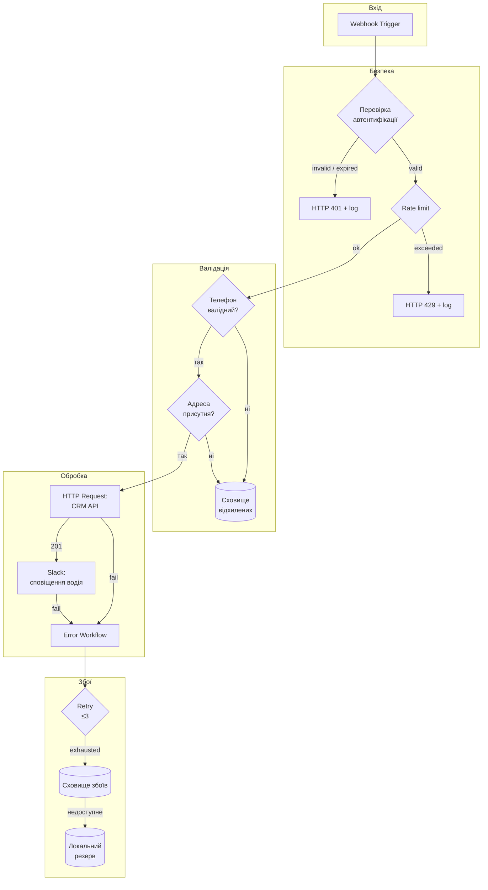

# Сирий вихід прогону `e4-n8n-spec-v3`

> Згенеровано з stream-json логу headless-сесії без змін змісту. Редакція: фейковий ключ → `<FAKE_KEY>`, локальні шляхи → відносні шляхи в репо / `<scratchpad>` / `~`. Команди довші за 300 символів обрізано з позначкою `…[обрізано]`, багаторядкові — `…[+N рядк.]`; повні — у stream-json логах.

| Поле | Значення |
|---|---|
| Модель | `claude-opus-4-5-20251101` |
| Режим дозволів | `default` |
| Результат | `success` · ходів 2 · $0.3 · 105 с · відмов у дозволах: 0 |

## Запит

````text

# Специфікація n8n-інтеграції з брифу клієнта

## Роль

Інженер з автоматизацій агенції, який проєктує n8n-воркфлоу для продакшну:
думає про валідацію, збої, навантаження й креденшели, а не лише про щасливий
шлях.

## Мета

Скласти з брифу технічну специфікацію n8n-воркфлоу, за якою розробник збудує
інтеграцію, а клієнт перевірить критерії приймання.

## Контекст

- Єдине джерело: `docs/sanitized-brief.md` — санітизований бриф: задача, обсяги,
  критерії приймання, перелік доступів (лише назви змінних), синтетичні
  приклади заявок.
- Оригінал брифу містить персональні дані й секрети і для моделі **закритий** —
  не шукай і не читай інших брифів чи файлів у `materials/`.
- Платформа: n8n (self-hosted). Доступи — через n8n credentials або змінні
  середовища з назвами, наведеними в брифі.

## Обмеження

- Не вигадуй значень креденшелів, URL, імен чи контактів — лише назви змінних із
  брифу.
- Не заповнюй прогалин припущеннями мовчки: чого немає в брифі — у «Відкриті
  питання до клієнта»; якщо без припущення не обійтись — позначай його
  `ПРИПУЩЕННЯ:`.
- Лише специфікація: не генеруй JSON воркфлоу, не створюй файлів, не звертайся
  до n8n чи інших сервісів.

## Acceptance criteria

- [ ] Кожен критерій приймання з брифу змаплено: `критерій → як забезпечено
      (вузол / механізм) → як перевірити (тест-кейс)`.
- [ ] Правила валідації телефону й адреси описано так, що синтетичний рядок 1
      з брифу проходить, а рядки 2 і 3 відхиляються, — показано таблицею по
      кожному рядку.
- [ ] Ті самі правила перевірено й на **негативних** прикладах, яких немає в
      брифі: незбалансовані дужки в телефоні, неповний номер, відсутнє або
      `null`-поле адреси. Кожен такий вхід іде у відхилені заявки, а не падає
      помилкою воркфлоу; regex наведено такий, що справді відхиляє ці приклади.
- [ ] Для вимоги «сповіщення водію ≤ 2 хвилини» названо тип тригера й точку,
      де вимірюється затримка.
- [ ] Для відхилених заявок описано: куди записуються, які поля, як формується
      звіт.
- [ ] Для недоступності CRM, Slack **і самого сховища відхилених чи збійних
      заявок** описано поведінку: повтори, error workflow, незалежний резерв і
      процедура звірки. Якщо резерву немає, гарантія «жодна заявка не
      губиться» сформульована як умовна — діє лише після успішного запису в
      сховище.
- [ ] Для кожного сховища поза CRM (відхилені заявки, збої) визначено мінімальний
      набір полів із персональними даними, строк зберігання й хто має доступ;
      повний сирий payload — лише з обґрунтуванням і захистом доступу.
- [ ] Вхідний вебхук захищено: автентифікація (shared secret або HMAC-підпис),
      захист від повторного відтворення (timestamp / nonce) і rate limiting;
      неавтентифіковані чи прострочені запити відхиляються **до** будь-якого
      запису в CRM чи сповіщення в Slack.
- [ ] Оцінено піковий потік (заявок/год у пікові дні з ~400/тиждень) і
      сказано, чи потрібна черга.
- [ ] Кожен зовнішній сервіс згадано лише через назву змінної/credential із
      брифу; у специфікації немає жодного значення секрету, URL, імені чи
      телефону.
- [ ] Кожен сервіс із переліку доступів використано в потоці лише тоді, коли
      його роль прямо названа в задачі брифу; сервіс без названої ролі не
      отримує призначення «на здогад» — його роль винесено у «Відкриті
      питання до клієнта».
- [ ] Кожен крок поточного ручного процесу з брифу або замінено вузлом, або
      явно позначено як виключений — з поясненням чому.
- [ ] Інші незрозумілі з брифу речі винесено у «Відкриті питання до клієнта»
      або позначено `ПРИПУЩЕННЯ:`, а не вигадано мовчки.

## Формат відповіді

Markdown-документ із розділами:
1. Потік (схема `mermaid flowchart`).
2. Вузли: `# | вузол n8n | що робить | вхід → вихід | credential`.
3. Безпека вхідного вебхука: автентифікація, повтори, rate limiting.
4. Валідація: правила + таблиця синтетичних рядків + таблиця негативних прикладів.
5. Критерії приймання → реалізація → тест-кейс.
6. Збої й повтори, зокрема недоступність сховища відхилених заявок.
7. Персональні дані в допоміжних сховищах: поля, строк зберігання, доступ.
8. Навантаження.
9. Відкриті питання до клієнта.

## Stop

Після специфікації зупинись: не пиши код вузлів і JSON воркфлоу, доки
відкриті питання не закриті з клієнтом.

````

## Виклики інструментів (підряд однакові згорнуто)

```text
1× Read: docs/sanitized-brief.md
```

## Фінальна відповідь агента

Тепер маю повну картину з санітизованого брифу. Складу специфікацію n8n-воркфлоу.

---

# Специфікація n8n-воркфлоу: автоматизація заявок на перевезення

**Клієнт:** [CLIENT_1]  
**Версія:** 1.0 (draft)  
**Дата:** 2026-09-14

---

## 1. Потік



---

## 2. Вузли

| # | Вузол n8n | Що робить | Вхід → Вихід | Credential / змінна |
|---|---|---|---|---|
| 1 | **Webhook** | Приймає POST із заявкою | HTTP request → JSON body | `INTAKE_WEBHOOK_URL` (налаштування n8n) |
| 2 | **Code (Auth)** | Перевіряє HMAC-підпис і timestamp | headers + body → `{valid: bool, reason}` | `WEBHOOK_HMAC_SECRET` (нова, див. §3) |
| 3 | **IF (Auth OK)** | Розгалуження | `valid` → continue / reject | — |
| 4 | **Respond to Webhook (401)** | Відповідь 401 + лог | — | — |
| 5 | **Code (Rate Limit)** | Лічильник запитів за IP/хв | IP → `{allowed: bool}` | `RATE_LIMIT_STORE` (Redis/memory) |
| 6 | **IF (Rate OK)** | Розгалуження | — | — |
| 7 | **Respond to Webhook (429)** | Відповідь 429 + лог | — | — |
| 8 | **Code (Validate)** | Regex телефону + перевірка адреси | body → `{phoneOk, addrOk, errors[]}` | — |
| 9 | **IF (Valid)** | Розгалуження | — | — |
| 10 | **HTTP Request (Rejected Store)** | Запис відхиленої заявки | payload → response | **ПРИПУЩЕННЯ:** `AIRTABLE_BASE_ID` + `AIRTABLE_PAT` або `ORDERS_DB_URL` (див. §9) |
| 11 | **HTTP Request (CRM)** | Створення запису в CRM | valid payload → CRM response | `CRM_API_KEY` |
| 12 | **Slack** | Повідомлення водія | CRM ID + дані → message | `SLACK_BOT_TOKEN` |
| 13 | **Error Workflow** | Глобальний обробник помилок | error object → retry / log | — |
| 14 | **HTTP Request (Failure Store)** | Запис збійної заявки | error + payload → response | **ПРИПУЩЕННЯ:** `AIRTABLE_BASE_ID` + `AIRTABLE_PAT` або `ORDERS_DB_URL` |
| 15 | **Write Binary File (Local Fallback)** | Резервний запис на диск, якщо сховище збоїв недоступне | payload → `/var/n8n/fallback/*.json` | — |

---

## 3. Безпека вхідного вебхука

### 3.1 Автентифікація (HMAC-SHA256)

- Джерело заявок підписує body ключем `WEBHOOK_HMAC_SECRET` і передає підпис у заголовку `X-Signature-256`.
- Вузол **Code (Auth)** обчислює `HMAC-SHA256(body, secret)` і порівнює з заголовком (constant-time comparison).
- Невідповідність → HTTP 401.

**ПРИПУЩЕННЯ:** джерело заявок (пошта → парсер чи форма) вміє генерувати HMAC. Якщо ні — альтернатива: shared secret у query-параметрі + IP allowlist.

### 3.2 Захист від повторного відтворення (replay)

- Заголовок `X-Timestamp` (Unix seconds). 
- Якщо `|now − timestamp| > 300 с` → запит відхиляється (401).
- ПРИПУЩЕННЯ: годинники джерела й n8n синхронізовані (NTP).

### 3.3 Rate limiting

- Лічильник запитів за IP за останню хвилину (sliding window).
- Поріг: **60 req/min/IP** (конфігурується).
- Перевищення → HTTP 429, без запису в CRM/Slack.

### 3.4 Порядок перевірок

1. HMAC → 2. Timestamp → 3. Rate limit → 4. Валідація payload.

Невалідний або прострочений запит не доходить до CRM чи Slack.

---

## 4. Валідація

### 4.1 Правила

| Поле | Правило | Regex / логіка |
|---|---|---|
| Телефон | Формат `+380 (XX) XXX-XX-XX` — 10 цифр після +380, дужки й дефіси на місці, збалансовані | `^\+380 \(\d{2}\) \d{3}-\d{2}-\d{2}$` |
| Адреса | Присутня, не порожня, не `null`, довжина ≥ 5 символів | `typeof addr === 'string' && addr.trim().length >= 5` |

### 4.2 Таблиця синтетичних рядків із брифу

| # | Телефон | Адреса | Телефон OK? | Адреса OK? | Результат |
|---|---|---|---|---|---|
| 1 | `+380 (00) 000-00-01` | `м. Тестове, вул. Прикладна 1, кв. 1` | ✅ regex match | ✅ len=38 | **Прийнято** |
| 2 | `+380 (00) 000-0` | `м. Тестове, просп. Зразковий 2` | ❌ лише 8 цифр | ✅ len=31 | **Відхилено** |
| 3 | `+380 (00) 000-00-03` | _(порожньо)_ | ✅ regex match | ❌ empty | **Відхилено** |

### 4.3 Таблиця негативних прикладів (поза брифом)

| # | Вхід | Чому невалідний | Regex / логіка → результат | Очікувана поведінка |
|---|---|---|---|---|
| N1 | `+380 (00 000-00-01` | Незбалансовані дужки — відсутня `)` | Regex не збігається | **Відхилено**, запис у сховище відхилених |
| N2 | `+380 (00) 000-00` | Неповний номер — 8 цифр замість 10 | Regex не збігається | **Відхилено** |
| N3 | `+38000000000001` | Без дужок і дефісів | Regex не збігається | **Відхилено** |
| N4 | телефон OK, адреса `null` | `null` — не рядок | `typeof null !== 'string'` | **Відхилено** |
| N5 | телефон OK, адреса `"  "` (лише пробіли) | `trim().length === 0` | Перевірка не проходить | **Відхилено** |
| N6 | телефон OK, адреса `"м."` | Занадто коротка (len=2 < 5) | Перевірка не проходить | **Відхилено** |

Усі негативні випадки записуються в сховище відхилених (вузол 10), а не падають помилкою воркфлоу.

---

## 5. Критерії приймання → реалізація → тест-кейс

| Критерій із брифу | Як забезпечено (вузол / механізм) | Тест-кейс |
|---|---|---|
| Заявка з некоректним телефоном не потрапляє в CRM | Вузол 8 (Validate) + IF (вузол 9) направляє на rejected store, CRM-вузол не викликається | Надіслати рядок 2 → перевірити, що CRM не отримав запиту, запис є в rejected store |
| Заявка без адреси доставки не потрапляє в CRM | Вузол 8 + IF (вузол 9) | Надіслати рядок 3 → CRM порожній, rejected store містить запис |
| Сповіщення водію ≤ 2 хвилини після заявки | Webhook Trigger (instant, тип `Immediately`) запускає синхронний потік; Slack — одразу після CRM | Виміряти `timestamp(Slack message) − timestamp(Webhook received)`; assertion ≤ 120 с. Точка вимірювання: metadata Slack API response (`ts`) мінус header `X-Timestamp` вхідного запиту |
| Усі відхилені заявки видно в окремому звіті | Вузол 10 записує в Airtable/Postgres; Airtable view або SQL-запит формує звіт | Відхилити 3 заявки → перевірити, що всі 3 є у звіті з полями: `timestamp`, `phone`, `address`, `errors[]` |

---

## 6. Збої й повтори

### 6.1 Стратегія повторів

| Сервіс | Retry policy | Back-off |
|---|---|---|
| CRM API | 3 спроби | Exponential: 2 с → 4 с → 8 с |
| Slack | 3 спроби | 1 с → 2 с → 4 с |
| Rejected Store | 3 спроби | 1 с → 2 с → 4 с |
| Failure Store | 2 спроби | 1 с → 2 с |

### 6.2 Error Workflow

- Після вичерпання спроб запис іде у **Failure Store** (вузол 14).
- Alert у окремий Slack-канал або email (потребує credential — див. §9).

### 6.3 Недоступність сховища відхилених (вузол 10)

Якщо Airtable/Postgres для rejected store недоступний:
1. Retry (3×).
2. Якщо все одно fail → Error Workflow → Failure Store.
3. Якщо й Failure Store недоступний → **Local Fallback** (вузол 15): запис JSON у `/var/n8n/fallback/rejected-{uuid}.json`.

### 6.4 Недоступність Failure Store (вузол 14)

1. Retry (2×).
2. Fail → Local Fallback (вузол 15).

### 6.5 Гарантія «жодна заявка не губиться»

**Умовна:** діє лише якщо хоча б одне з трьох сховищ (основне, failure, local fallback) доступне в момент запису. Повна втрата (диск + мережа) — заявка втрачена.

### 6.6 Процедура звірки

Раз на добу (або після інциденту):
1. Порівняти `count(CRM records)` + `count(rejected)` + `count(failures)` із `count(webhook logs)`.
2. Переглянути `/var/n8n/fallback/` — якщо файли є, імпортувати вручну.

---

## 7. Персональні дані в допоміжних сховищах

| Сховище | Мета | Поля з PII | Строк зберігання | Доступ |
|---|---|---|---|---|
| Rejected Store | Звіт відхилених заявок | `customer_name`, `phone` (masked: останні 4 цифри), `address` (перші 20 символів), `errors[]`, `timestamp` | 30 днів | Операційний відділ ([CONTACT_1]) |
| Failure Store | Діагностика збоїв | `customer_name`, `phone` (повний), `address`, `error_message`, `timestamp` | 14 днів | DevOps, операційний відділ |
| Local Fallback | Аварійне сховище | Повний payload (raw JSON) | До ручного імпорту | Sysadmin (файлова система сервера n8n) |

**Обґрунтування повного payload у Failure / Local Fallback:** необхідно для повторної обробки після відновлення сервісу. Захист: файлова система n8n-сервера з обмеженим SSH-доступом; Failure Store — той самий credential, що й Rejected Store, з тими самими ACL.

---

## 8. Навантаження

| Параметр | Значення |
|---|---|
| Середній потік | ~400 заявок / 7 днів ≈ 57 / день ≈ 2.4 / год |
| Пікові дні | Понеділок, четвер — ПРИПУЩЕННЯ: ×3 → ~170 заявок / день → ~21 / год (якщо 8 робочих годин) |
| Піковий потік (миттєвий) | ПРИПУЩЕННЯ: burst до 10 заявок / хв у найгарячішу годину |

**Висновок:** черга **не потрібна** для поточного обсягу. n8n webhook обробляє десятки req/s синхронно. Rate limit 60/min/IP — достатній запас.

**Рекомендація:** моніторити `execution time > 30 s`; якщо обсяг зросте вдесятеро, розглянути Queue Mode (Redis + workers).

---
## 9. Відкриті питання до клієнта

| # | Питання | Чому важливо |
|---|---|---|
| 1 | **Airtable, Postgres, Google Sheets:** яка роль кожного сервісу? Бриф надає credentials, але не вказує, де зберігати rejected/failure records, звідки читати довідники тощо. | Без цього неможливо призначити вузли 10, 14; поки що ПРИПУЩЕННЯ: Airtable = rejected + failures. |
| 2 | **Google Sheets:** у переліку доступів немає — його взагалі автоматизовувати чи це лише legacy-джерело? | Якщо Sheets лишається, потрібен credential `GOOGLE_SHEETS_CRED`. |
| 3 | **Джерело заявок:** звідки надходить POST на webhook? Пошта → парсер (Zapier, Make, n8n email trigger)? Форма? Інша система? | Впливає на формат payload і спосіб підпису (HMAC). |
| 4 | **Формат payload:** які поля обов'язкові, які опціональні? Чи є поле `driver_id` для вибору водія, чи сповіщення йде в загальний канал? | Без `driver_id` Slack-повідомлення йде в канал, а не конкретному водієві. |
| 5 | **Slack-канал / user ID водія:** куди саме слати? | Потрібен `SLACK_CHANNEL_ID` або логіка визначення водія. |
| 6 | **HMAC-підпис вхідних запитів:** чи джерело підтримує? Якщо ні — яка альтернатива (shared secret, IP allowlist)? | Безпека вебхука. |
| 7 | **Rate limit:** 60/min/IP достатньо? Чи є внутрішні сервіси, яким потрібен вищий ліміт? | Можлива помилка 429 для легітимних запитів. |
| 8 | **Строк зберігання rejected / failure:** 30 / 14 днів прийнятно? | Compliance, GDPR-аналоги. |
| 9 | **Alert-канал для збоїв:** Slack-канал ops-команди, email, PagerDuty? | Потрібен credential. |
| 10 | **Postgres (репліка):** лише для читання довідників чи для запису? | Репліка зазвичай read-only. |

---

## Маппінг ручного процесу → автоматизація

| Крок ручного процесу (з брифу) | Автоматизовано (вузол) | Коментар |
|---|---|---|
| Менеджер копіює дані з пошти в Google Sheets | **Виключено** — якщо джерело заявок надсилає POST на webhook, Sheets не потрібен як проміжний буфер | Потребує уточнення: чи Sheets лишається? |
| Менеджер створює запис у CRM | Вузол 11 (HTTP Request → CRM) | — |
| Менеджер повідомляє водія в Slack | Вузол 12 (Slack) | — |

---

## Stop

Специфікація готова до рев'ю. Не генерую JSON воркфлоу, поки відкриті питання (§9) не закриті з клієнтом.
