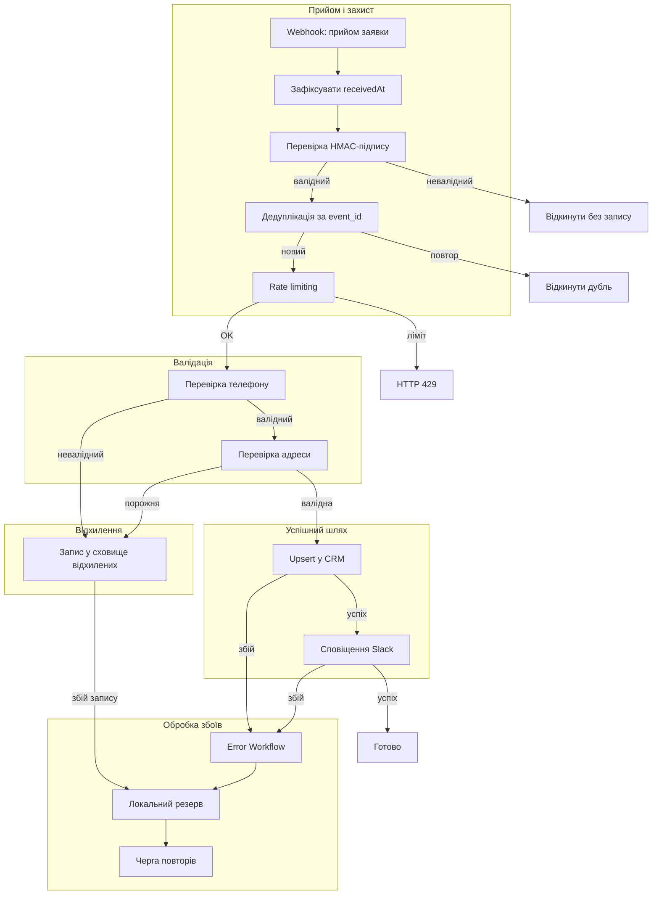

# Сирий вихід прогону `g1-n8n-spec-v4`

> Сформовано з stream-json логу headless-сесії **з редагуванням**: фейковий ключ → `<FAKE_KEY>`, локальні шляхи → відносні шляхи в репо / `<scratchpad>` / `~`, команди довші за 300 символів обрізано (`…[обрізано]`), багаторядкові — `…[+N рядк.]`. Поза цими замінами текст запиту й фінальної відповіді агента не змінювався. Повні stream-json логи зберігались лише в тимчасовому каталозі робочої сесії й до репозиторію не входять: цей файл — збережений слід прогону.

| Поле | Значення |
|---|---|
| Модель | `claude-opus-4-5-20251101` |
| Режим дозволів | `default` |
| Результат | `success` · ходів 2 · $0.36 · 139 с · відмов у дозволах: 0 |

## Запит

````text

# Специфікація n8n-інтеграції з брифу клієнта

## Роль

Інженер з автоматизацій агенції, який проєктує n8n-воркфлоу для продакшну:
думає про валідацію, збої, навантаження й креденшели, а не лише про щасливий
шлях.

## Мета

Скласти з брифу технічну специфікацію n8n-воркфлоу, за якою розробник збудує
інтеграцію, а клієнт перевірить критерії приймання.

## Контекст

- Єдине джерело: `docs/sanitized-brief.md` — санітизований бриф: задача, обсяги,
  критерії приймання, перелік доступів (лише назви змінних), синтетичні
  приклади заявок.
- Оригінал брифу містить персональні дані й секрети і для моделі **закритий** —
  не шукай і не читай інших брифів чи файлів у `materials/`.
- Платформа: n8n (self-hosted). Доступи — через n8n credentials або змінні
  середовища з назвами, наведеними в брифі.

## Обмеження

- Не вигадуй значень креденшелів, URL, імен чи контактів — лише назви змінних із
  брифу. Якщо вимоги безпеки потребують credential, якого в брифі немає (напр.
  секрет підпису вебхука), познач його `НОВИЙ CREDENTIAL (немає в брифі)` і
  винеси у «Відкриті питання до клієнта».
- Не заповнюй прогалин припущеннями мовчки: чого немає в брифі — у «Відкриті
  питання до клієнта»; якщо без припущення не обійтись — позначай його
  `ПРИПУЩЕННЯ:`.
- Лише специфікація: не генеруй JSON воркфлоу, не створюй файлів, не звертайся
  до n8n чи інших сервісів.

## Acceptance criteria

- [ ] Кожен критерій приймання з брифу змаплено: `критерій → як забезпечено
      (вузол / механізм) → як перевірити (тест-кейс)`.
- [ ] Правила валідації телефону й адреси описано так, що синтетичний рядок 1
      з брифу проходить, а рядки 2 і 3 відхиляються, — показано таблицею по
      кожному рядку.
- [ ] Ті самі правила перевірено й на **негативних** прикладах, яких немає в
      брифі: незбалансовані дужки в телефоні, неповний номер, відсутнє або
      `null`-поле адреси. Кожен такий вхід іде у відхилені заявки, а не падає
      помилкою воркфлоу; regex наведено такий, що справді відхиляє ці приклади.
- [ ] Кількість цифр номера в тексті правила, у regex і в прикладах **однакова**;
      для формату наведено точні тест-кейси «приймається / відхиляється».
- [ ] Для вимоги «сповіщення водію ≤ 2 хвилини» названо тип тригера й спосіб
      виміру: від **серверного** `receivedAt`, зафіксованого в момент прийняття
      вебхука, до часу відповіді Slack — не від часу із заголовка відправника.
- [ ] Для відхилених заявок описано: куди записуються, які поля, як формується
      звіт.
- [ ] Для недоступності CRM, Slack **і самого сховища відхилених чи збійних
      заявок** описано поведінку: повтори, error workflow, незалежний резерв і
      процедура звірки. Якщо резерву немає, гарантія «жодна заявка не
      губиться» сформульована як умовна — діє лише після успішного запису в
      сховище.
- [ ] Для **кожного** сховища поза CRM — відхилені заявки, збої, локальний
      резерв — визначено: мінімальний набір полів із персональними даними,
      максимальний строк зберігання з автоматичним видаленням (для локального
      резерву — ще й процедура очищення), шифрування at rest і **окремий**
      credential з мінімальними правами, не спільний з іншими сховищами. Повний
      сирий payload — лише з обґрунтуванням.
- [ ] Вхідний вебхук захищено:
      - автентифікація HMAC-підписом або секретом **лише в заголовку** через TLS —
        ніколи в URL чи query-параметрі; IP allowlist — лише додатковий контроль;
      - захист від повторів — унікальний ID події або nonce з **атомарною
        дедуплікацією** (одного вікна timestamp недостатньо);
      - rate limiting;
      - порядок: після мінімального розбору, потрібного для перевірки,
        автентифікація, перевірка повтору й rate limit завершуються **до**
        бізнес-валідації та до будь-якого запису чи журналювання даних запиту —
        у CRM, Slack, сховищі відхилених, сховищі збоїв, локальному резерві й
        логах.
- [ ] Кожен вихідний виклик із credential (CRM, Slack, сховища) — лише HTTPS із
      перевіркою сертифіката; редирект не виконується з передачею credential,
      доки нову адресу й дозвіл не перевірено окремо, — інакше запит
      відхиляється.
- [ ] Повтори створення запису в CRM ідемпотентні: стабільний ID події
      передається в CRM, створення — через upsert або дедуплікацію за цим ID,
      тож таймаут після успішного запису не створює дубль.
- [ ] Оцінено піковий потік (заявок/год у пікові дні з ~400/тиждень) і
      сказано, чи потрібна черга; висновки, не підтверджені вимірюваннями
      (затримка, конкурентність, повтори, burst-тест), позначено `ПРИПУЩЕННЯ:`.
- [ ] Кожен зовнішній сервіс згадано лише через назву змінної/credential із
      брифу; у специфікації немає жодного значення секрету, URL, імені чи
      телефону.
- [ ] Кожен сервіс із переліку доступів використано в потоці лише тоді, коли
      його роль прямо названа в задачі брифу; сервіс без названої ролі не
      отримує призначення «на здогад» — його роль винесено у «Відкриті
      питання до клієнта».
- [ ] Кожен крок поточного ручного процесу з брифу або замінено вузлом, або
      явно позначено як виключений — з поясненням чому.
- [ ] Інші незрозумілі з брифу речі винесено у «Відкриті питання до клієнта»
      або позначено `ПРИПУЩЕННЯ:`, а не вигадано мовчки.

## Формат відповіді

Markdown-документ із розділами:
1. Потік (схема `mermaid flowchart`).
2. Вузли: `# | вузол n8n | що робить | вхід → вихід | credential`.
3. Безпека вхідного вебхука: автентифікація, повтори й дедуплікація, rate
   limiting, порядок перевірок.
4. Безпека вихідних викликів: HTTPS і сертифікати, редиректи, ідемпотентність CRM.
5. Валідація: правила + таблиця синтетичних рядків + таблиця негативних прикладів.
6. Критерії приймання → реалізація → тест-кейс.
7. Збої й повтори, зокрема недоступність сховища відхилених заявок.
8. Персональні дані в допоміжних сховищах: поля, строк і видалення, шифрування,
   окремий доступ.
9. Навантаження.
10. Відкриті питання до клієнта.

## Stop

Після специфікації зупинись: не пиши код вузлів і JSON воркфлоу, доки
відкриті питання не закриті з клієнтом.

````

## Виклики інструментів (підряд однакові згорнуто)

```text
1× Read: docs/sanitized-brief.md
```

## Фінальна відповідь агента

Тепер я маю всю інформацію для складання специфікації. Почну з аналізу й напишу повний документ.

---

# Специфікація n8n-воркфлоу: автоматизація обробки заявок на перевезення — [CLIENT_1]

## 1. Потік



## 2. Вузли

| # | Вузол n8n | Що робить | Вхід → Вихід | Credential |
|---|-----------|-----------|--------------|------------|
| 1 | Webhook | Приймає POST із заявкою; фіксує `receivedAt = Date.now()` у першому рядку коду | HTTP request → JSON + `receivedAt` | `НОВИЙ CREDENTIAL (немає в брифі): WEBHOOK_HMAC_SECRET` |
| 2 | Code: Auth | Перевіряє HMAC-SHA256 підпис із заголовка `X-Signature`; порівнює з обчисленим від body | JSON → pass/reject | (використовує `WEBHOOK_HMAC_SECRET`) |
| 3 | Code: Dedup | Перевіряє `event_id` в атомарному сховищі (Redis/Postgres counter); записує якщо новий | JSON → pass/reject | `НОВИЙ CREDENTIAL (немає в брифі): DEDUP_STORE_CREDENTIAL` |
| 4 | Code: Rate Limit | Перевіряє ліміт за IP/client_id (token bucket або sliding window) | JSON → pass/429 | (спільне з Dedup або окреме) |
| 5 | Code: Validate Phone | Regex + перевірка кількості цифр | JSON → valid/invalid | — |
| 6 | Code: Validate Address | Перевіряє наявність і непорожність поля `address` | JSON → valid/invalid | — |
| 7 | IF: Validation OK? | Розгалуження за результатом валідації | — | — |
| 8 | HTTP Request: CRM Upsert | POST/PUT до CRM з `event_id` як ідемпотентним ключем | JSON → CRM response | `CRM_API_KEY` |
| 9 | Slack: Send Message | Надсилає повідомлення водію в канал/DM | CRM response → Slack response | `SLACK_BOT_TOKEN` |
| 10 | HTTP Request: Rejected Store | Записує відхилену заявку в сховище | JSON → store response | `НОВИЙ CREDENTIAL (немає в брифі): REJECTED_STORE_CREDENTIAL` |
| 11 | Error Workflow | Ловить помилки, записує в локальний резерв, ставить у чергу повторів | Error → backup | `НОВИЙ CREDENTIAL (немає в брифі): ERROR_STORE_CREDENTIAL` |
| 12 | Code: Local Backup | Атомарний запис у локальний файл/SQLite як останній резерв | Error → file | — (локальний доступ) |

## 3. Безпека вхідного вебхука

### 3.1 Автентифікація

- **Метод:** HMAC-SHA256 підпис у заголовку `X-Signature` (або `X-Hub-Signature-256`).
- **Секрет:** `WEBHOOK_HMAC_SECRET` — `НОВИЙ CREDENTIAL (немає в брифі)`.
- **Перевірка:** `timingSafeEqual(computedSignature, receivedSignature)`.
- **Заборонено:** секрет в URL, query-параметрі, body.
- **IP allowlist:** додатковий контроль (якщо відома IP-адреса джерела), але не заміна HMAC.
- **TLS:** обов'язковий; n8n має приймати лише HTTPS.

### 3.2 Захист від повторів (replay protection)

- **Механізм:** унікальний `event_id` у кожному запиті від джерела.
- **Атомарна дедуплікація:** перед будь-якою обробкою — `SETNX` в Redis або `INSERT ... ON CONFLICT DO NOTHING` в Postgres з унікальним індексом на `event_id`.
- **Вікно:** зберігати ID протягом 24–72 годин (достатньо для затриманих повторів).
- **Чому не лише timestamp:** timestamp без ID не захищає від replay тієї ж події в межах вікна.

### 3.3 Rate limiting

- **Алгоритм:** token bucket або sliding window log.
- **Ключ:** IP-адреса або `client_id` із заголовка (якщо є).
- **Ліміти:** `ПРИПУЩЕННЯ:` 100 req/min на джерело; потребує уточнення з клієнтом.
- **Відповідь:** HTTP 429 без розкриття деталей запиту.

### 3.4 Порядок перевірок

```
1. Мінімальний парсинг (body → JSON, витягнути signature header)
2. HMAC-автентифікація → якщо невалідно, відкинути (без логування body)
3. Дедуплікація за event_id → якщо повтор, відкинути
4. Rate limiting → якщо перевищено, HTTP 429
5. (лише після цього) Бізнес-валідація, запис у CRM/Slack/сховища
```

**Критично:** жодного запису в CRM, Slack, сховище відхилених, сховище збоїв, локальний резерв чи лог до завершення кроків 2–4.

## 4. Безпека вихідних викликів

### 4.1 HTTPS і сертифікати

- **Протокол:** лише HTTPS для CRM, Slack, усіх сховищ.
- **Перевірка сертифіката:** увімкнена (за замовчуванням в n8n); не вимикати `rejectUnauthorized`.

### 4.2 Редиректи

- **Політика:** не виконувати автоматичний redirect, що передає credential/cookie на нову адресу.
- **Реалізація в n8n:** `followRedirect: false` або перевірка нової адреси перед передачею токена.
- **Якщо redirect необхідний:** зафіксувати нову адресу, повідомити Error Workflow, чекати ручної перевірки.

### 4.3 Ідемпотентність CRM

- **Стабільний ID:** `event_id` з вхідного запиту передається як `idempotency_key` або зовнішній ID в CRM.
- **Upsert:** використовувати `POST /orders` з `Idempotency-Key` header, або `PUT /orders/{event_id}`, або CRM-native deduplication.
- **Результат:** повторний запит після таймауту не створює дубля; CRM повертає існуючий запис.

## 5. Валідація

### 5.1 Правила

#### Телефон

- **Формат:** `+380 (XX) XXX-XX-XX` — рівно 9 цифр після коду країни (код оператора 2 + абонентський 7).
- **Regex:** 
  ```regex
  ^\+380\s?\(\d{2}\)\s?\d{3}-\d{2}-\d{2}$
  ```
- **Логіка:**
  1. Поле `phone` існує і не `null`/`undefined`/порожній рядок.
  2. Після trim відповідає regex.
  3. Загальна кількість цифр: 12 (380 + 9).

#### Адреса

- **Правило:** поле `address` існує, не `null`, не `undefined`, після trim не порожнє.
- **Regex (мінімальний):** 
  ```regex
  ^.+$
  ```
  (застосовується після trim; порожній рядок не матчить).

### 5.2 Таблиця синтетичних рядків із брифу

| # | Телефон | Адреса | Телефон валідний? | Адреса валідна? | Результат |
|---|---------|--------|-------------------|-----------------|-----------|
| 1 | `+380 (00) 000-00-01` | `м. Тестове, вул. Прикладна 1, кв. 1` | ✅ (9 цифр, формат OK) | ✅ (непорожня) | **Приймається** |
| 2 | `+380 (00) 000-0` | `м. Тестове, просп. Зразковий 2` | ❌ (6 цифр замість 9) | ✅ | **Відхиляється** |
| 3 | `+380 (00) 000-00-03` | _(порожньо)_ | ✅ | ❌ (порожня) | **Відхиляється** |

### 5.3 Таблиця негативних прикладів (додаткові edge cases)

| Вхід (телефон) | Вхід (адреса) | Чому відхиляється | Regex матчить? | Результат |
|----------------|---------------|-------------------|----------------|-----------|
| `+380 (00 000-00-01` | `м. Тест` | Незбалансована дужка (відсутня `)`) | ❌ | Відхилено (валідація) |
| `+380 (00)) 000-00-01` | `м. Тест` | Зайва `)` | ❌ | Відхилено (валідація) |
| `+380 (00) 000-00` | `м. Тест` | Неповний номер (7 цифр замість 9) | ❌ | Відхилено (валідація) |
| `+380 (00) 000-00-0` | `м. Тест` | 8 цифр замість 9 | ❌ | Відхилено (валідація) |
| `null` | `м. Тест` | Поле телефону `null` | — (перевірка до regex) | Відхилено (валідація) |
| `+380 (00) 000-00-01` | `null` | Поле адреси `null` | — | Відхилено (валідація) |
| `+380 (00) 000-00-01` | `   ` | Адреса — лише пробіли | — (trim → порожньо) | Відхилено (валідація) |
| `+380(00)000-00-01` | `м. Тест` | Немає пробілів (якщо regex strict) | ❌ при strict | `ПРИПУЩЕННЯ:` strict — відхилено |

**Примітка:** усі ці випадки завершуються записом у сховище відхилених заявок, а не помилкою воркфлоу.

### 5.4 Кількість цифр — консистентність

| Де | Значення |
|----|----------|
| Текст правила | 9 цифр після +380 (2 оператор + 7 абонент) |
| Regex | `\d{2}` + `\d{3}` + `\d{2}` + `\d{2}` = 9 цифр |
| Приклад 1 (приймається) | `00` + `000` + `00` + `01` = 9 цифр ✅ |
| Приклад 2 (відхиляється) | `00` + `000` + `0` = 6 цифр ❌ |

## 6. Критерії приймання → реалізація → тест-кейс

| Критерій із брифу | Як забезпечено (вузол / механізм) | Тест-кейс |
|-------------------|-----------------------------------|-----------|
| Заявка з некоректним телефоном не потрапляє в CRM | Вузол 5 (Validate Phone) відхиляє; IF (7) направляє в Rejected Store (10); CRM (8) не викликається | Надіслати заявку з телефоном `+380 (00) 000-0`; перевірити: CRM не містить запису, сховище відхилених містить запис із причиною «invalid phone» |
| Заявка без адреси доставки не потрапляє в CRM | Вузол 6 (Validate Address) відхиляє порожню/null адресу; IF (7) → Rejected Store (10) | Надіслати заявку з порожнім полем `address`; перевірити: CRM не містить, сховище відхилених містить із причиною «missing address» |
| Сповіщення водію ≤ 2 хвилини після заявки | `receivedAt` фіксується у вузлі 1 одразу при прийманні; Slack (9) викликається одразу після CRM; метрика: `slack_response_time - receivedAt` | Надіслати 10 заявок у пік; для кожної виміряти `(Slack API response timestamp) - receivedAt`; усі мають бути < 120 000 ms |
| Усі відхилені заявки видно в окремому звіті | Rejected Store (10) зберігає кожну відхилену заявку з полями для звіту; звіт генерується з цього сховища | Відхилити 5 заявок із різними причинами; відкрити звіт; перевірити: всі 5 присутні з коректними причинами й timestamps |

## 7. Збої й повтори

### 7.1 Недоступність CRM

| Ситуація | Поведінка |
|----------|-----------|
| HTTP 5xx / timeout | Retry з exponential backoff: 1s → 2s → 4s → 8s (max 3 retries) |
| Після 3 невдач | Error Workflow (11) → запис у локальний резерв (12) → черга повторів |
| Успіх після retry | Продовжити до Slack |

### 7.2 Недоступність Slack

| Ситуація | Поведінка |
|----------|-----------|
| HTTP 5xx / timeout / rate limit | Retry: 1s → 2s → 4s (max 3) |
| Після 3 невдач | Error Workflow; запис у CRM вже зроблено — позначити в error log для ручного повідомлення |

### 7.3 Недоступність сховища відхилених заявок

| Ситуація | Поведінка |
|----------|-----------|
| Rejected Store (10) недоступний | Fallback на локальний резерв (12) — атомарний append до локального файлу або SQLite |
| Локальний резерв також збоїть | Останній fallback: запис у stderr/stdout n8n з alert на monitoring |

### 7.4 Гарантія «жодна заявка не губиться»

**Умовна:** гарантія діє **після успішного запису** в одне зі сховищ:
1. CRM (для валідних) **або**
2. Rejected Store (для відхилених) **або**
3. Локальний резерв (для збоїв).

До цього моменту — якщо всі три недоступні одночасно — заявка може бути втрачена. Для абсолютної гарантії потрібен синхронний ACK лише після запису, що потребує уточнення архітектури з клієнтом.

### 7.5 Процедура звірки

- Щоденно: порівняти кількість отриманих вебхуків (логи n8n або окремий лічильник) із сумою записів у CRM + Rejected Store + Локальний резерв.
- Розбіжність → ручне розслідування.
- Локальний резерв після успішного replay → очистити (див. розділ 8.3).

## 8. Персональні дані в допоміжних сховищах

### 8.1 Сховище відхилених заявок (Rejected Store)

| Параметр | Значення |
|----------|----------|
| **Мінімальний набір полів** | `event_id`, `receivedAt`, `rejection_reason`, `customer_name`, `phone` (masked: останні 4 цифри), `address` (якщо є); **без** повного телефону й без `sum` |
| **Обґрунтування повного payload** | Не зберігати повний payload — достатньо ID для відновлення з джерела |
| **Максимальний строк зберігання** | 90 днів |
| **Автоматичне видалення** | Scheduled workflow або DB TTL policy видаляє записи старші 90 днів |
| **Шифрування at rest** | Увімкнене на рівні сховища (Airtable Enterprise / Postgres `pgcrypto` / encrypted disk) |
| **Credential** | `REJECTED_STORE_CREDENTIAL` — `НОВИЙ CREDENTIAL (немає в брифі)`; окремий від CRM/Slack, з правами лише INSERT/SELECT/DELETE на таблицю відхилених |

### 8.2 Сховище збоїв (Error Store)

| Параметр | Значення |
|----------|----------|
| **Мінімальний набір полів** | `event_id`, `receivedAt`, `error_type`, `error_message`, `retry_count`, `last_retry_at` |
| **PII** | Не зберігати PII в error store; лише `event_id` для join із джерелом |
| **Максимальний строк** | 30 днів (після успішного retry або manual resolution — негайне видалення) |
| **Шифрування** | at rest |
| **Credential** | `ERROR_STORE_CREDENTIAL` — окремий |

### 8.3 Локальний резерв (Local Backup)

| Параметр | Значення |
|----------|----------|
| **Мінімальний набір полів** | Повний payload необхідний для replay; `ПРИПУЩЕННЯ:` зберігати зашифрованим |
| **Обґрунтування** | Без повного payload неможливо відновити заявку для повторної обробки |
| **Максимальний строк** | 7 днів |
| **Процедура очищення** | Scheduled job щодня: replay успішні → видалити; старші 7 днів → alert + force delete |
| **Шифрування** | AES-256 at rest; ключ у `LOCAL_BACKUP_ENCRYPTION_KEY` — `НОВИЙ CREDENTIAL (немає в брифі)` |
| **Credential** | Локальний доступ; ключ шифрування окремий |

## 9. Навантаження

### 9.1 Оцінка

| Метрика | Значення | Джерело |
|---------|----------|---------|
| Середній потік | ~400 заявок/тиждень | Бриф |
| Середній потік/день | ~57 заявок/день | Розрахунок |
| Пікові дні | Понеділок, четвер | Бриф |
| `ПРИПУЩЕННЯ:` пікове навантаження | ~150 заявок/день у пік | 2.5x від середнього |
| `ПРИПУЩЕННЯ:` піковий burst | ~50 заявок/годину | Якщо 150 за 8 робочих годин нерівномірно |

### 9.2 Чи потрібна черга?

**`ПРИПУЩЕННЯ:`** при ~50 req/год і типовій затримці CRM+Slack ~2-5 сек на запит, n8n з дефолтною конкурентністю (~10-20 parallel executions) справляється без черги.

**Не підтверджено вимірюваннями:**
- Реальна затримка CRM API
- Реальна конкурентність n8n instance
- Поведінка під burst-навантаженням
- Retry storms при частковій недоступності

**Рекомендація:** провести load test із 100 req/хв перед продакшном; якщо p99 latency > 30 сек або error rate > 1%, додати Redis queue (BullMQ pattern) між webhook і обробкою.

## 10. Відкриті питання до клієнта

| # | Питання | Контекст |
|---|---------|----------|
| 1 | Яка роль **Airtable** (`AIRTABLE_BASE_ID`, `AIRTABLE_PAT`) у задачі? | У брифі є credentials, але роль не вказана. Не використовувати без чіткого призначення. |
| 2 | Яка роль **Postgres репліки** (`ORDERS_DB_URL`) у задачі? | Аналогічно: є credentials, роль не названа. |
| 3 | Яке джерело надсилає заявки на вхідний webhook? | Потрібно для: формату payload, налаштування HMAC-секрету, IP allowlist. |
| 4 | Чи підтримує джерело `event_id` і HMAC-підпис? | Якщо ні — узгодити формат або прийняти ризик replay/spoofing. |
| 5 | Де зберігати відхилені заявки? | Варіанти: окрема таблиця в CRM, Airtable, Postgres, Google Sheets. Потрібен credential. |
| 6 | Де зберігати звіт про відхилені? | Той самий сервіс чи окремий dashboard? |
| 7 | Хто «водій» і як його ідентифікувати для Slack? | Один канал? User ID? Lookup по регіону? |
| 8 | Який формат/канал Slack: channel post чи DM? | Впливає на API call і permissions. |
| 9 | Яка допустима затримка для retry після збою CRM? | Для налаштування exponential backoff. |
| 10 | Чи є SLA на uptime CRM і Slack? | Для оцінки ймовірності збоїв і потреби в резерві. |
| 11 | Чи є моніторинг / alerting на стороні клієнта? | Куди слати alerts про збої воркфлоу? |
| 12 | Чи допустимий варіант із втратою заявки при одночасній недоступності всіх сховищ? | Якщо ні — потрібна синхронна архітектура з ACK лише після запису. |
| 13 | Чи strict формат телефону (+380 з пробілами та дефісами), чи допускаються варіації? | `+380(00)000-00-01` без пробілів — валідний чи ні? |
| 14 | Яка retention policy для персональних даних у клієнта? | Для налаштування TTL у сховищах. |
| 15 | Чи потрібен load test перед продакшном? | Рекомендовано для підтвердження оцінки навантаження. |

---

## Stop

Специфікацію завершено. Не генерую JSON воркфлоу чи код вузлів, доки відкриті питання не закриті з клієнтом.
